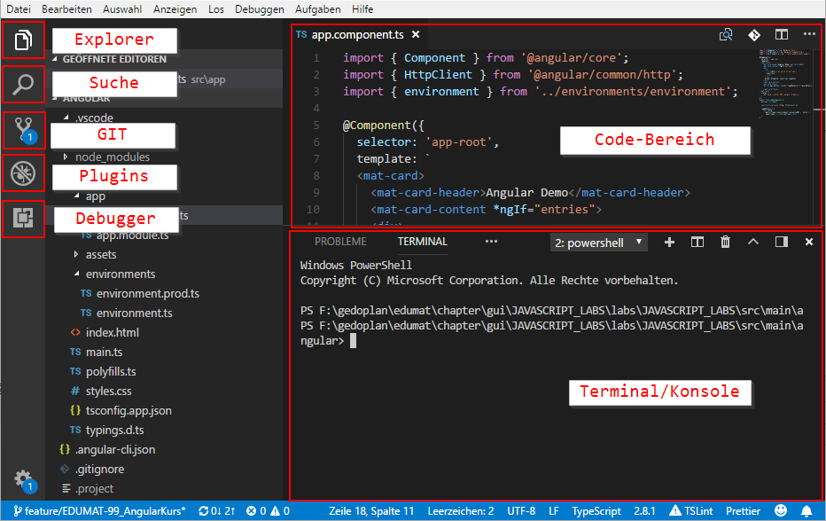

= Visual Studio Code: Einrichtung

== 1. Vorbemerkung
Visual Studio Code (VSCode) ist ein von Microsoft bereitgestellter freier Quelltexteditor. Dank der großen Anzahl von verfügbaren Erweiterungen lässt sich mit diesem Editor nahezu jede Programmiersprache bequem bearbeiten. Insbesondere bei der Entwicklung von Angular-/HTML-Anwendungen sowie für Dockerfiles und Kubernetes-Objektbeschreibungen erfreut sich VSCode großer Beliebtheit. Grundsätzlich lassen sich dafür auch die bekannten Java IDEs nutzen - gegebenenfalls angereichert mit zusätzlichen Erweiterungen. Dabei erreichen diese, Stand heute, jedoch bei weitem nicht den Komfort von VSCode.

== 2. Download / Installation
VSCode kann kostenfrei heruntergeladen werden, sowohl als Installer als auch als ZIP-Version. Dabei stehen sowohl Windows-, als auch Linux- und Mac-Versionen zur Verfügung:

https://code.visualstudio.com/

_Bei Seminaren, die dieses Tool benötigen, wird der Download durch den Aufruf von mvn im Verzeichnis labs bereits durchgeführt und die Anwendung im Verzeichnis
tools\target\vscode bereitgestellt._

== 3. Grundsätzliche Bedienung der Anwendung

Eine zentraler Shortcut ist dabei: Ctrl+Shift+P . Dieser ruft die Befehlspalette auf, über die nahezu jede Funktion von VSCode und den installierten Erweiterungen aufgerufen werden kann.

== 4. VSCode im Seminar
Wie oben beschrieben wird VSCode mittels Maven bereits heruntergeladen. Bei dieser Version von VSCode handelt es sich um die ZIP-Version des Editors, die bereits mit einigen Plugins angereichert wurde:

* alphabotsec.vscode-eclipse-keybindings
** Tastenkürzel wie bei Eclipse
* johnpapa.angular-essentials
** Angular Support
* .zignd.html-css-class-completion
** CSS-Klassen Erweiterung
* esbenp.prettier-vscode
** Formatierer für CSS, JavaScript, TypeScript, HTML